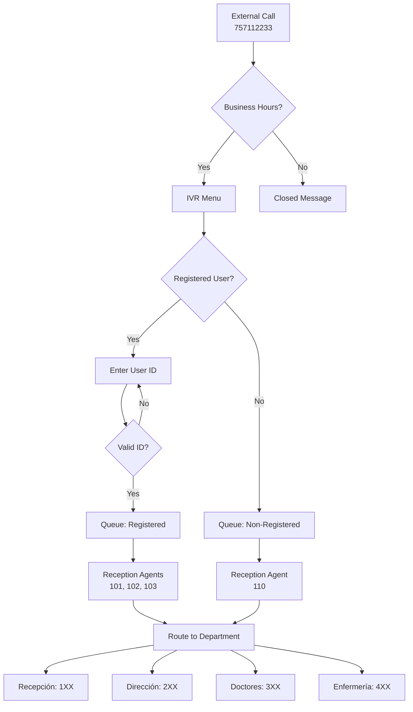

## Overview

This page presents a complete implementation of a health center call center system using Asterisk. The system includes:

- IVR menu for caller routing
- Multiple departments (Reception, Direction, Doctors, Nursing)
- Call queues with music on hold
- Business hours checking
- Database integration for user management
- Voicemail system
- Call pickup and transfer capabilities
- TLS encryption for secure calls

## System Architecture



## System Specifications

### Contact Information
- **Main phone**: 757112233
- **Business hours**: Monday-Friday, 8:00 AM - 8:00 PM

### Departments

<CardGroup cols={2}>
  <Card title="Recepción (100s)" icon="desk">
    Extensions 101-110
    - 101, 102, 103: Registered users
    - 110: Non-registered users
  </Card>
  <Card title="Dirección (200s)" icon="building">
    Extensions 201-203
    - Management staff
    - Can pickup any call
  </Card>
  <Card title="Doctores (300s)" icon="user-doctor">
    Extensions 301-303
    - Medical doctors
  </Card>
  <Card title="Enfermería (400s)" icon="stethoscope">
    Extensions 401-403
    - Nursing staff
  </Card>
</CardGroup>

### Features by Department

All departments have:
- ✅ TLS encryption
- ✅ Voicemail access via `*[extension]`
- ✅ Call pickup within team via `*8[extension]`
- ✅ Group calling via `X00` (e.g., 100, 200, 300, 400)
- ✅ External calling capability

## Database Schema

The system uses MariaDB with two tables:

### Table: personal

Stores staff information:

```sql
CREATE TABLE personal(
  extension INTEGER NOT NULL,
  nombre VARCHAR(20) NOT NULL,
  equipo VARCHAR(10) NOT NULL,
  id INTEGER NOT NULL,
  PRIMARY KEY (id)
);
```

**Sample data:**

| Extension | Name | Team | ID |
|-----------|------|---------|----|
| 101 | MARIA | RECEPCION | 1001 |
| 102 | IGNACIO | RECEPCION | 1002 |
| 201 | BELEN | DIRECCION | 2001 |
| 301 | LAURA | DOCTORES | 3001 |
| 401 | ISABEL | ENFERMERIA | 4001 |

### Table: usuarios

Stores registered patient information:

```sql
CREATE TABLE usuarios(
  nombre VARCHAR(20) NOT NULL,
  id INTEGER NOT NULL,
  PRIMARY KEY (id)
);
```

**Sample data:**

| Name | ID |
|------|----|
| JULIA | 50 |
| MARIO | 51 |
| PAULA | 52 |

## Configuration Files

### sip.conf - User Definitions

<Accordion title="General settings">
```conf
[general]
port=5060
directmedia=no
language=es
context=public

; TLS settings
tlsenable=yes
tlsbindaddr=0.0.0.0
tlscertfile=/etc/asterisk/keys/asterisk.pem
tlscafile=/etc/asterisk/keys/ca.crt
tlscipher=ALL
tlsclientmethod=tlsv1

; Message settings
accept_outofcall_message=yes
outofcall_message_context=mensajes
auth_message_requests=yes
subscribecontext=suscribir
```
</Accordion>

<Accordion title="Reception staff (100s)">
```conf
[101]
type=friend
secret=100101
context=recepcion
host=dynamic
canreinvite=no
nat=force_rport,comedia
callgroup=1
pickupgroup=1
transport=tls

[102]
type=friend
secret=100102
context=recepcion
host=dynamic
canreinvite=no
nat=force_rport,comedia
callgroup=1
pickupgroup=1
transport=tls

[103]
type=friend
secret=100103
context=recepcion
host=dynamic
canreinvite=no
nat=force_rport,comedia
callgroup=1
pickupgroup=1
transport=tls

[110]
type=friend
secret=100110
context=recepcion
host=dynamic
canreinvite=no
nat=force_rport,comedia
callgroup=1
pickupgroup=1
transport=tls
```
</Accordion>

<Accordion title="Direction staff (200s)">
```conf
[201]
type=friend
secret=200201
context=direccion
host=dynamic
canreinvite=no
nat=force_rport,comedia
callgroup=2
pickupgroup=1-4  ; Can pickup from all groups
transport=tls

[202]
type=friend
secret=200202
context=direccion
host=dynamic
canreinvite=no
nat=force_rport,comedia
callgroup=2
pickupgroup=1-4
transport=tls

[203]
type=friend
secret=200203
context=direccion
host=dynamic
canreinvite=no
nat=force_rport,comedia
callgroup=2
pickupgroup=1-4
transport=tls
```

<Note>
  Direction staff has `pickupgroup=1-4`, allowing them to pickup calls from any department.
</Note>
</Accordion>

<Accordion title="Doctors (300s) and Nursing (400s)">
```conf
; Doctors
[301]
type=friend
secret=300301
context=doctores
host=dynamic
canreinvite=no
nat=force_rport,comedia
callgroup=3
pickupgroup=3
transport=tls

; Nursing
[401]
type=friend
secret=400401
context=enfermeria
host=dynamic
canreinvite=no
nat=force_rport,comedia
callgroup=4
pickupgroup=4
transport=tls
```
</Accordion>

### extensions.conf - Dial Plan

<Accordion title="Incoming call handling with business hours">
```conf
[exterior]
; Check business hours (Mon-Fri 8:00-20:00)
exten => 757112233,1,GotoIfTime(8:00-20:00,mon-fri,*,*?abierto,1,1)
same => n,Festival(En estos momentos no hay nadie que te pueda atender)
same => n,Festival(Nuestro horario es de 8 a 20 horas de lunes a viernes)
same => n,Hangup()

[abierto]
; Welcome message and IVR menu
exten => 1,1,Answer()
same => n,Festival(Bienvenido al centro de salud)
same => n(loop),Festival(Presione)
same => n,SayNumber(1)
same => n,Festival(si es un usuario registrado o)
same => n,SayNumber(2)
same => n,Festival(en caso contrario)
same => n,Read(opcion,,1,3)
same => n,SayNumber(${opcion})
same => n,GotoIf($["${opcion}" = "1"]?10,1)
same => n,GotoIf($["${opcion}" = "2"]?20,1)
same => n,Festival(Opcion incorrecta)
same => n,Goto(1,loop)
same => n,Hangup()

; Registered user - ask for ID
exten => 10,1(id),Festival(Por favor marque su numero de identificacion o presione)
same => n,SayNumber(9)
same => n,Festival(para volver al menu)
same => n,Read(id,,4,3,5)
same => n,SayNumber(${id})
same => n,GotoIf($["${id}" = "9"]?1,loop)
same => n,Set(nombre=${ODBC_usuario(${id})})  ; Database lookup
same => n,GotoIf($["${nombre}" != ""]?recepcion,1,1)
same => n,Festival(Usuario no encontrado)
same => n,Goto(10,id)
same => n,Hangup()

; Non-registered user
exten => 20,1,Goto(recepcion,2,1)
same => n,Hangup()
```
</Accordion>

<Accordion title="Reception queue handling">
```conf
[recepcion]
; Group calling
exten => _X00,1,Festival(Llamada a grupo ${EXTEN})
same => n,Goto(llamar-grupo,${EXTEN},1)
same => n,Hangup()

; Registered users queue
exten => 1,1,Set(CHANNEL(musicclass)=recepcion)
same => n,Answer()
same => n,Festival(Hola ${nombre})
same => n(reg),Festival(Por favor espere a que le atiendan)
same => n,Queue(registrados,,,,60)
same => n,Goto(1,reg)
same => n,Hangup()

; Non-registered users queue
exten => 2,1,Set(CHANNEL(musicclass)=recepcion)
same => n,Answer()
same => n(noreg),Festival(Por favor espere a que le atiendan)
same => n,Queue(noregistrados,,,,60)
same => n,Goto(2,noreg)
same => n,Hangup()

; Call to specific extension
exten => _XXX,1,Set(extension=${EXTEN})
same => n,Set(nombre=${ODBC_extension(${extension})})  ; DB lookup
same => n,GotoIf($["${nombre}" != ""]?llamar,${extension},1)
same => n,Festival(La extension ${extension} no se encuentra disponible)
same => n,Hangup()

; Voicemail access
exten => _*XXX,1,Set(llamante=${CALLERID(num)})
same => n,Goto(buzon-voz,1,1)
same => n,Hangup()

; Call pickup (reception can only pickup own group)
exten => _*8.,1,Set(extension=${EXTEN:2})
same => n,Set(pref=${extension:0:1})
same => n,GotoIf($["${pref}" = "1"]?llamar,8,1)
same => n,Festival(No tiene permiso para capturar una llamada a la extension ${extension})
same => n,Hangup()
```
</Accordion>

<Accordion title="Department contexts (Direction example)">
```conf
[direccion]
; Group calling
exten => _X00,1,Festival(Llamada a grupo ${EXTEN})
same => n,Goto(llamar-grupo,${EXTEN},1)
same => n,Hangup()

; Call to extension
exten => _XXX,1,Set(extension=${EXTEN})
same => n,Set(nombre=${ODBC_extension(${extension})})
same => n,GotoIf($["${nombre}" != ""]?llamar,${extension},1)
same => n,Festival(La extension ${extension} no se encuentra disponible)
same => n,Hangup()

; Voicemail
exten => _*XXX,1,Set(llamante=${CALLERID(num)})
same => n,Goto(buzon-voz,1,1)
same => n,Hangup()

; Call pickup (direction can pickup from any group)
exten => _*8.,1,Set(extension=${EXTEN:2})
same => n,Goto(llamar,8,1)  ; No group restriction!
same => n,Hangup()

; External calling
exten => _XXXXXXXXX,1,Goto(llamar,${EXTEN},1)
same => n,Hangup()
```

<Note>
  Direction staff has no group restriction on call pickup, unlike other departments.
</Note>
</Accordion>

<Accordion title="Group calling implementation">
```conf
[llamar-grupo]
; Reception
exten => 100,1,Dial(SIP/101&SIP/102&SIP/103&SIP/110,60)
same => n,Hangup()

; Direction
exten => 200,1,Dial(SIP/201&SIP/202&SIP/203,60)
same => n,Hangup()

; Doctors
exten => 300,1,Dial(SIP/301&SIP/302&SIP/303,60)
same => n,Hangup()

; Nursing
exten => 400,1,Dial(SIP/401&SIP/402&SIP/403,60)
same => n,Hangup()

; Unknown group
exten => s,1,Festival(Grupo ${extension} no se encuentra disponible)
same => n,Hangup()
```
</Accordion>

<Accordion title="Voicemail with PIN verification">
```conf
[buzon-voz]
exten => 1,1,Festival(Para acceder a su buzon de voz)
same => n(pin),Festival(Marque su numero de identificacion privado)
same => n,Read(pin,,4,3,5)
same => n,Set(idpin=${ODBC_pin(${llamante})})  ; Get PIN from DB
same => n,GotoIf($["${pin}" = "${idpin}"]?2,1)
same => n,Festival(Numero de identificacion erroneo)
same => n,Goto(1,pin)
same => n,Hangup()

exten => 2,1,Festival(Marque 1 para continuar)
same => n,VoiceMailMain(${llamante})
same => n,Hangup()
```

<Note>
  The PIN is verified against the database before allowing voicemail access.
</Note>
</Accordion>

### queues.conf - Call Queues

```conf
[general]
persistentmembers = yes
monitor-type = MixMonitor

[registrados]
strategy = leastrecent
timeout = 30
member => SIP/101
member => SIP/102
member => SIP/103

[noregistrados]
strategy = leastrecent
timeout = 30
member => SIP/110
```

**Queue parameters:**
- **strategy = leastrecent**: Calls the agent who hasn't taken a call in the longest time
- **timeout = 30**: Ring each agent for 30 seconds before moving to next
- **members**: Static list of agents assigned to this queue

### func_odbc.conf - Database Functions

```conf
[usuario]
dsn=asterisk
readsql=SELECT nombre from usuarios WHERE id='${SQL_ESC(${ARG1})}'

[extension]
dsn=asterisk
readsql=SELECT nombre from personal where extension='${SQL_ESC(${ARG1})}'

[pin]
dsn=asterisk
readsql=SELECT id from personal where extension='${SQL_ESC(${ARG1})}'

[equipo]
dsn=asterisk
readsql=SELECT lower(equipo) from personal where extension='${SQL_ESC(${ARG1})}'
```

**Functions:**
- `${ODBC_usuario(id)}`: Look up patient name by ID
- `${ODBC_extension(ext)}`: Look up staff name by extension
- `${ODBC_pin(ext)}`: Get voicemail PIN for extension
- `${ODBC_equipo(ext)}`: Get department/team for extension

### voicemail.conf - Voicemail Boxes

```conf
[general]
format=wav49|gsm|wav
serveremail=asterisk
attach=yes
skipms=3000
maxsilence=10
silencethreshold=128
maxlogins=3

[default]
; PIN verified via database, so just use dummy PIN here
101 => 1,101,101@centrosalud.es
102 => 1,102,102@centrosalud.es
103 => 1,103,103@centrosalud.es
110 => 1,110,110@centrosalud.es
201 => 1,201,201@centrosalud.es
202 => 1,202,202@centrosalud.es
203 => 1,203,203@centrosalud.es
301 => 1,301,301@centrosalud.es
302 => 1,302,302@centrosalud.es
303 => 1,303,303@centrosalud.es
401 => 1,401,401@centrosalud.es
402 => 1,402,402@centrosalud.es
403 => 1,403,403@centrosalud.es
```

<Note>
  The actual PIN authentication happens in the dial plan via database lookup, so the PIN in voicemail.conf is just a placeholder.
</Note>

## Call Flow Examples

### Registered User Call

<Steps>
  <Step title="User dials 757112233">
    External caller dials the main number
  </Step>
  <Step title="Business hours check">
    System checks if current time is Mon-Fri 8:00-20:00
  </Step>
  <Step title="IVR menu">
    Caller hears welcome message and presses 1 for registered user
  </Step>
  <Step title="Enter user ID">
    Caller enters their 4-digit ID (e.g., 0050)
  </Step>
  <Step title="Database lookup">
    System queries: `SELECT nombre from usuarios WHERE id='50'`
  </Step>
  <Step title="Personalized greeting">
    System says: "Hola JULIA, por favor espere a que le atiendan"
  </Step>
  <Step title="Queue">
    Call enters 'registrados' queue, rings agents 101, 102, 103
  </Step>
  <Step title="Agent answers">
    First available agent picks up and can route to appropriate department
  </Step>
</Steps>

### Internal Extension Call

<Steps>
  <Step title="Doctor dials 201">
    Extension 301 wants to reach direction
  </Step>
  <Step title="Database lookup">
    `SELECT nombre from personal where extension='201'` returns "BELEN"
  </Step>
  <Step title="Dial">
    System announces "Llamando a BELEN" and dials SIP/201
  </Step>
  <Step title="No answer">
    After 15 seconds, goes to voicemail
  </Step>
</Steps>

### Call Pickup Scenario

<Steps>
  <Step title="Incoming call to 102">
    Extension 102 is ringing but agent is away
  </Step>
  <Step title="Coworker picks up">
    Extension 101 dials *8102
  </Step>
  <Step title="Permission check">
    System checks: Both are in callgroup=1, pickupgroup=1 ✅
  </Step>
  <Step title="Call transferred">
    Extension 101 now connected to the caller
  </Step>
</Steps>

## Testing the System

### 1. Test Business Hours

<CodeGroup>
```bash During business hours
# Call should reach IVR menu
Dial: 757112233
Expect: "Bienvenido al centro de salud..."
```

```bash Outside business hours
# Call should hear closed message
Dial: 757112233
Expect: "En estos momentos no hay nadie..."
```
</CodeGroup>

### 2. Test Registered User Flow

```text
1. Dial 757112233
2. Press 1 (registered user)
3. Enter ID: 0050
4. Hear: "Hola JULIA, por favor espere..."
5. Music on hold
6. Agent answers
```

### 3. Test Database Integration

From Asterisk CLI:

```bash
CLI> dialplan show
CLI> database show
```

Test ODBC functions:

```bash
# Check if extension 101 exists
CLI> originate Local/101@test extension test@test
```

### 4. Test Voicemail

```text
1. From ext 201, dial *201
2. Enter PIN from database (2001)
3. Should access voicemail
```

## Monitoring and Maintenance

### View Queue Status

```bash
CLI> queue show registrados
```

Expected output:

```text
registrados has 0 calls (max unlimited) in 'leastrecent' strategy
   Members:
      SIP/101 (dynamic) (Not in use) has taken no calls yet
      SIP/102 (dynamic) (Not in use) has taken 3 calls (last was 125 secs ago)
      SIP/103 (dynamic) (Not in use) has taken 1 call (last was 45 secs ago)
   No Callers
```

### Check Active Calls

```bash
CLI> core show channels
```

### Monitor Call Quality

```bash
CLI> sip show peers
```

Look for:
- Status = OK
- Latency < 100ms

## Performance Optimization

<Accordion title="Queue optimization">
  - Adjust `timeout` based on average answer time
  - Use `ringinuse=no` to prevent calls to busy agents
  - Enable `announcefrequency` for long waits
  - Set `maxlen` to limit queue size
</Accordion>

<Accordion title="Database optimization">
  - Add indexes on frequently queried columns:
    ```sql
    CREATE INDEX idx_personal_ext ON personal(extension);
    CREATE INDEX idx_usuarios_id ON usuarios(id);
    ```
  - Enable ODBC connection pooling in res_odbc.conf
  - Set reasonable `pre-connect` in res_odbc.conf
</Accordion>

<Accordion title="Audio quality">
  - Use consistent codec across all endpoints
  - Configure QoS on network equipment
  - Monitor jitter and packet loss
  - Place Asterisk on dedicated VLAN
</Accordion>

## Common Customizations

### Add New Department

<Steps>
  <Step title="Add extensions to sip.conf">
    Define 5XX range for new department
  </Step>
  <Step title="Create context in extensions.conf">
    Add [nuevodepartamento] with same pattern as others
  </Step>
  <Step title="Add to database">
    Insert staff into personal table with equipo='NUEVODEPARTAMENTO'
  </Step>
  <Step title="Configure call groups">
    Set callgroup=5, pickupgroup=5 in sip.conf
  </Step>
  <Step title="Add group calling">
    Add 500 => Dial(SIP/501&SIP/502...) to [llamar-grupo]
  </Step>
</Steps>

### Modify IVR Menu

Edit the [abierto] context:

```conf
; Add option 3 for appointments
exten => 1,n,SayNumber(3)
exten => 1,n,Festival(para solicitar una cita)
exten => 1,n,Read(opcion,,1,3)
exten => 1,n,GotoIf($["${opcion}" = "3"]?30,1)

exten => 30,1,Goto(citas,s,1)
```

### Add Holiday Schedule

```conf
exten => 757112233,1,GotoIfTime(*,*,1,jan?cerrado,1,1)  ; New Year's Day
same => n,GotoIfTime(*,*,25,dec?cerrado,1,1)  ; Christmas
same => n,GotoIfTime(8:00-20:00,mon-fri,*,*?abierto,1,1)
same => n,Goto(cerrado,1,1)

[cerrado]
exten => 1,1,Festival(El centro está cerrado)
same => n,Hangup()
```

## Security Considerations

<Warning>
  **Production Recommendations:**
  
  1. **TLS Certificates**: Use proper CA-signed certificates
  2. **Database**: Use strong passwords, limit privileges
  3. **Firewall**: Restrict access to SIP/RTP ports
  4. **Fail2ban**: Protect against brute force attacks
  5. **Logging**: Enable CDR and CEL for audit trail
  6. **Backup**: Regular backups of database and config files
</Warning>

## Troubleshooting

<Accordion title="Queue not working">
  Check:
  - Agents registered: `sip show peers`
  - Queue membership: `queue show registrados`
  - Music on hold files exist: `ls /var/lib/asterisk/moh/`
  - Context correct in sip.conf for agents
</Accordion>

<Accordion title="Database lookups failing">
  Check:
  - ODBC connection: `odbc show`
  - Test query: `isql asterisk-connector`
  - func_odbc loaded: `module show like func_odbc`
  - SQL syntax in func_odbc.conf
</Accordion>

<Accordion title="Voicemail PIN incorrect">
  Check:
  - Database has correct ID in personal table
  - ODBC_pin function returns value
  - Caller ID is set correctly
  - Test: `SELECT id FROM personal WHERE extension='101'`
</Accordion>

## Next Steps

<CardGroup cols={2}>
  <Card title="PBX Interconnection" icon="network-wired" href="/advanced/pbx-interconnection">
    Connect this call center to other PBX systems
  </Card>
  <Card title="DUNDi Protocol" icon="key" href="/advanced/dundi-protocol">
    Enable distributed dial plan for multi-site deployments
  </Card>
</CardGroup>
