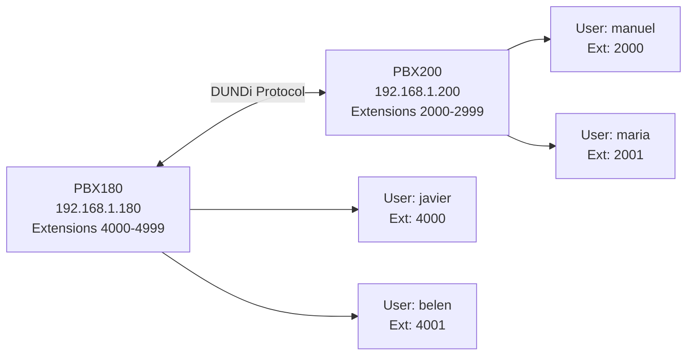

## Overview

PBX interconnection allows you to connect multiple Asterisk servers together, creating a distributed telephony network where users on different servers can communicate seamlessly. This is particularly useful for organizations with multiple locations or departments that need to maintain separate PBX systems while still enabling inter-office communication.

## Use Cases

### Multi-Location Organizations
- **Branch offices**: Each branch has its own PBX server
- **Geographic distribution**: Separate servers for different regions
- **Load distribution**: Distribute call processing across multiple servers

### Benefits

<CardGroup cols={2}>
  <Card title="Scalability" icon="chart-line">
    Scale your telephony infrastructure across multiple servers
  </Card>
  <Card title="Redundancy" icon="shield">
    Maintain service even if one PBX fails
  </Card>
  <Card title="Reduced Costs" icon="dollar-sign">
    Local calls within each PBX, interconnect only when needed
  </Card>
  <Card title="Administration" icon="users">
    Separate administration for different locations
  </Card>
</CardGroup>

## Architecture

When connecting two or more Asterisk servers, you'll typically use one of these protocols:

### DUNDi Protocol (Recommended)

DUNDi (Distributed Universal Number Discovery) is a peer-to-peer protocol designed specifically for sharing dial plan information between Asterisk servers. It provides:

- **Distributed lookups**: No central server required
- **Security**: Encryption using RSA keys
- **Efficiency**: Caches results to minimize network traffic
- **Flexibility**: Supports different routing priorities

### SIP Trunking

Alternatively, you can connect PBX systems using SIP trunks:

- **Standard protocol**: Works with any SIP-compatible system
- **Simple configuration**: Just configure as peer connections
- **Limitations**: Requires manual dial plan configuration

## Network Configuration Example

Here's a typical setup for connecting two Asterisk servers:



### Extension Numbering

When interconnecting PBXs, use non-overlapping extension ranges:

- **PBX180**: Extensions 4000-4999
- **PBX200**: Extensions 2000-2999

This prevents conflicts and makes routing straightforward.

## Dial Plan Strategy

To call between PBXs, users typically dial a prefix followed by the extension:

<Steps>
  <Step title="Local calls">
    Users dial the extension directly (e.g., `4000` for local user)
  </Step>
  <Step title="Remote calls">
    Users dial a prefix + extension (e.g., `999992000` to reach extension 2000 on remote PBX)
  </Step>
  <Step title="Routing">
    The PBX uses the prefix to determine it's a remote call and queries DUNDi
  </Step>
  <Step title="Connection">
    DUNDi returns the SIP address, and the call is routed
  </Step>
</Steps>

## Configuration Overview

Connecting two PBXs requires configuration in three main areas:

### 1. Extensions Configuration

Create special contexts for DUNDi routing:

```conf
[dundi-priv-canonical]
exten => _4XXX,1,Dial(Zap/g1/${EXTEN},20,rtT)

[dundi-priv-local]
include => dundi-priv-canonical
include => dundi-priv-customers
include => dundi-priv-via-pstn

[dundi-priv-switch]
switch => DUNDi/priv

[macro-dundi-priv]
exten => s,1,NoOp(Macro dundi-priv)
same => n,Goto(${ARG1},1)
include => dundi-priv-lookup
```

### 2. SIP Peer Configuration

Define the peer connection:

```conf
[priv]
type=peer
context=dundi-priv-local
disallow=all
allow=ilbc
```

### 3. Security Keys

Generate RSA key pairs for each server to enable encrypted communication.

<Note>
  See the [DUNDi Protocol](/advanced/dundi-protocol) page for detailed configuration steps.
</Note>

## Testing Connectivity

After configuration, verify the connection works:

<CodeGroup>
```bash CLI Command
CLI> dundi lookup 2000@priv bypass
```

```text Expected Output
1. 0 SIP/192.168.1.200/2000 (50)
DUNDi lookup completed in 45 ms
```
</CodeGroup>

## Common Issues

<Accordion title="Cannot reach remote extensions">
  **Possible causes:**
  - Firewall blocking DUNDi port (4520 UDP)
  - Incorrect MAC address in dundi.conf
  - Keys not properly exchanged
  - Extension patterns don't match

  **Solutions:**
  - Check firewall rules: `sudo ufw allow 4520/udp`
  - Verify MAC address: `ip a` (look for ether field)
  - Ensure public key is copied to remote server
  - Test with `dundi lookup` command
</Accordion>

<Accordion title="Authentication failures">
  **Possible causes:**
  - Wrong key names in configuration
  - Keys not in correct directory (/var/lib/asterisk/keys)
  - File permissions incorrect

  **Solutions:**
  - Verify key names match in dundi.conf
  - Check keys are in `/var/lib/asterisk/keys/`
  - Fix permissions: `sudo chown asterisk:asterisk /var/lib/asterisk/keys/*`
</Accordion>

<Accordion title="High latency or dropped calls">
  **Possible causes:**
  - Network congestion
  - Codec mismatch
  - NAT issues

  **Solutions:**
  - Use QoS on network equipment
  - Configure same codec on both ends (e.g., ilbc)
  - Configure NAT settings in sip.conf
</Accordion>

## Security Considerations

<Warning>
  Always use encryption when connecting PBXs over public networks:
  - Generate strong RSA keys (at least 2048 bits)
  - Use passwords on private keys
  - Restrict access by IP address when possible
  - Monitor for unusual traffic patterns
</Warning>

## Performance Tips

1. **Cache settings**: DUNDi caches results - adjust TTL based on how often extensions change
2. **Network optimization**: Place PBXs on same subnet when possible
3. **Codec selection**: Use bandwidth-efficient codecs like GSM or iLBC for inter-PBX calls
4. **Load balancing**: Distribute users evenly across PBX servers

## Next Steps

<CardGroup cols={2}>
  <Card title="DUNDi Protocol" icon="key" href="/advanced/dundi-protocol">
    Learn how to configure DUNDi for secure PBX interconnection
  </Card>
  <Card title="Call Center Example" icon="headset" href="/advanced/call-center-example">
    See a complete implementation with multiple departments
  </Card>
</CardGroup>
