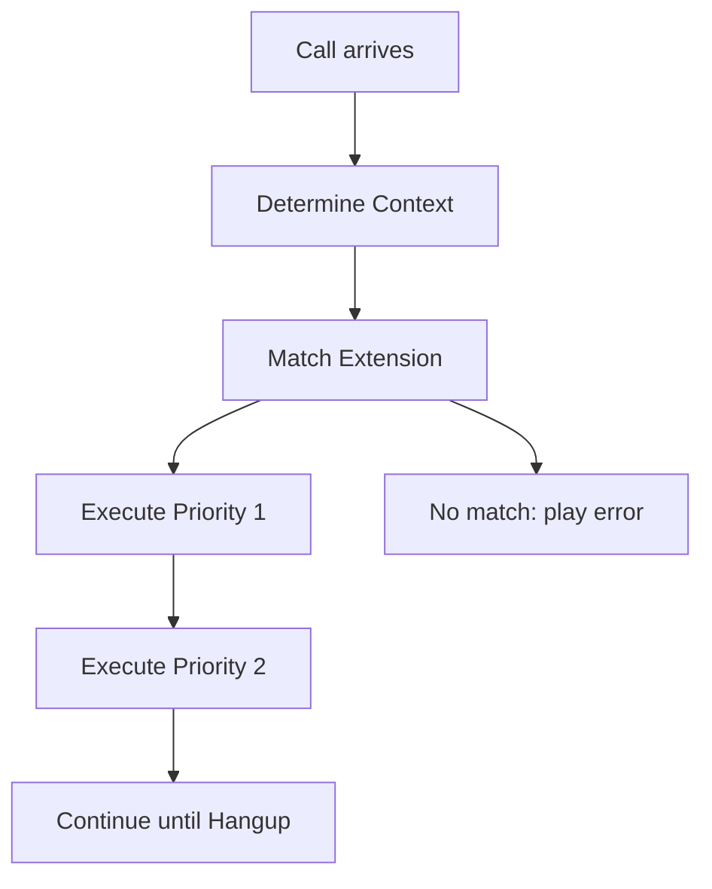

## What is the Dialplan?

The **dialplan** is the core of Asterisk's call routing functionality. It defines how Asterisk handles incoming and outgoing calls, determining what happens when someone dials an extension. The dialplan is configured in the `extensions.conf` file, typically located at `/etc/asterisk/extensions.conf`.

<Info>
Think of the dialplan as a programming language for telephony - it tells Asterisk exactly what to do with each call based on the number dialed and the caller's context.
</Info>

## Basic Syntax

The dialplan uses a simple but powerful syntax:

```conf
exten => extension,priority,application(arguments)
```

Where:
- **extension**: The number or pattern that was dialed
- **priority**: The order of execution (1, 2, 3, or `n` for next, or `same` for same extension)
- **application**: The action to perform (Dial, VoiceMail, Playback, etc.)
- **arguments**: Parameters passed to the application

### Simple Example

Here's a basic dialplan entry from the tutorial:

```conf extensions.conf
[empleado]
exten => 4000,1,NoOp(Llamando a Javier)
same => n,Dial(SIP/javier,15)
same => n,VoiceMail(${EXTEN})
same => n,Hangup()
```

This extension:
1. Logs a message when called
2. Rings the SIP device 'javier' for 15 seconds
3. If no answer, sends caller to voicemail
4. Hangs up the call

## Dialplan Structure

The `extensions.conf` file consists of several key sections:

<Steps>
  <Step title="[general] Section">
    Contains global dialplan settings:
    
    ```conf
    [general]
    static=yes
    writeprotect=no
    clearglobalvars=no
    ```
  </Step>

  <Step title="[globals] Section">
    Defines global variables available throughout the dialplan:
    
    ```conf
    [globals]
    CONSOLE=Console/dsp
    TRUNK=DAHDI/G2
    TRUNKMSD=1
    ```
  </Step>

  <Step title="Contexts">
    Logical groupings of extensions that provide security and organization:
    
    ```conf
    [empleado]
    ; Extensions for employees
    
    [recepcion]
    ; Extensions for reception
    
    [direccion]
    ; Extensions for management
    ```
  </Step>
</Steps>

## Execution Flow

When a call enters Asterisk, the following happens:



### Execution Example

From the tutorial's call center implementation:

```conf
[exterior]
exten => 757112233,1,GotoIfTime(8:00-20:00,mon-fri,*,*?abierto,1,1)
same => n,Festival(En estos momentos no hay nadie que te pueda atender)
same => n,Festival(Nuestro horario es de 8 a 20 horas de lunes a viernes)
same => n,Hangup()
```

<Steps>
  <Step title="Step 1: Check Time">
    Uses `GotoIfTime()` to check if calling during business hours (8am-8pm, Mon-Fri)
  </Step>
  
  <Step title="Step 2a: Business Hours">
    If during business hours, jumps to the `[abierto]` context
  </Step>
  
  <Step title="Step 2b: After Hours">
    If outside business hours, plays closed message using Festival TTS and hangs up
  </Step>
</Steps>

## Priority Notation

Asterisk supports multiple ways to specify priorities:

<CodeGroup>
```conf Numeric Priorities
exten => 4000,1,NoOp(First step)
exten => 4000,2,Dial(SIP/javier,15)
exten => 4000,3,VoiceMail(${EXTEN})
exten => 4000,4,Hangup()
```

```conf Using 'n' (Next)
exten => 4000,1,NoOp(First step)
exten => 4000,n,Dial(SIP/javier,15)
exten => 4000,n,VoiceMail(${EXTEN})
exten => 4000,n,Hangup()
```

```conf Using 'same'
exten => 4000,1,NoOp(First step)
same => n,Dial(SIP/javier,15)
same => n,VoiceMail(${EXTEN})
same => n,Hangup()
```
</CodeGroup>

<Tip>
Using `same => n` is the recommended modern syntax - it's cleaner and easier to maintain than repeating the extension number.
</Tip>

## Special Extensions

Asterisk provides special extension names:

| Extension | Purpose |
|-----------|----------|
| `s` | Start extension - where calls begin in a context |
| `i` | Invalid - handles invalid extension entries |
| `t` | Timeout - handles when caller doesn't dial anything |
| `h` | Hangup - executes when call is hung up |
| `T` | Absolute timeout - executes when absolute timeout is reached |

## Comments

Add comments to document your dialplan:

```conf
; This is a single-line comment

[empleado]  ; Inline comment
; Employee extensions
exten => 4000,1,Dial(SIP/javier,15)  ; Ring for 15 seconds
```

## Reloading the Dialplan

After making changes to `extensions.conf`, reload the dialplan without restarting Asterisk:

```bash
asterisk -rx "dialplan reload"
```

Or from the Asterisk CLI:

```
CLI> dialplan reload
```

## Testing the Dialplan

View the current dialplan configuration:

```
CLI> dialplan show
CLI> dialplan show empleado     ; Show specific context
CLI> dialplan show 4000@empleado ; Show specific extension
```

<Info>
The dialplan is executed sequentially, line by line. Understanding this flow is crucial for building complex call routing logic.
</Info>

## Next Steps

Now that you understand dialplan basics, explore:
- **Contexts**: Organizing extensions and providing security
- **Extensions**: Pattern matching and advanced routing
- **Applications**: The actions that make things happen
- **Variables**: Dynamic call handling and data storage